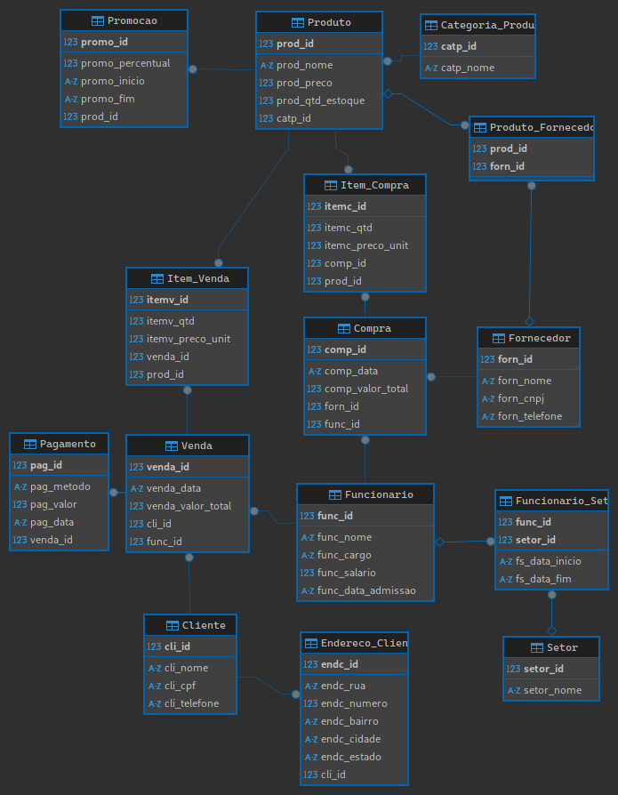

# Projeto Banco de Dados 2

## Mercado
Nosso grupo ira desenvolver um Banco de Dados para um supermercado

## Tabelas e seus campos

Mapa das Tabelas
 

 

- Categoria_Produto
- Fornecedor
- Cliente
- Funcionario
- Setor
- Produto
- Endereco_Cliente
- Venda
- Item_Venda
- Compra
- Item_Compra
- Pagamento
- Promocao
- Produto_Fornecedor
- Funcionario_Setor

## Views

- vw_Produto_Detalhes
- vw_Produto_Fornecedor
- vw_Cliente_Com_Endereco
- vw_Funcionario_Setor_Historico
- vw_Total_Itens_Por_Venda
- vw_Venda_Detalhada
- vw_Item_Venda_Detalhado
- vw_Total_Itens_Por_Compra
- vw_Compra_Detalhada
- vw_Promocao_Ativa
- TempoEmEstoque
- MetodoPag
- vw_Funcionarios_Ativos_Por_Setor
- vw_Produtos_Mais_Vendidos_Por_Periodo

## Triggers

- DelCli 
- DelFun 
- DelProd
- UpdateEstoqueVenda
- UpdateEstoqueCompra
- UpdateValorVenda
- UpdateValorCompra
